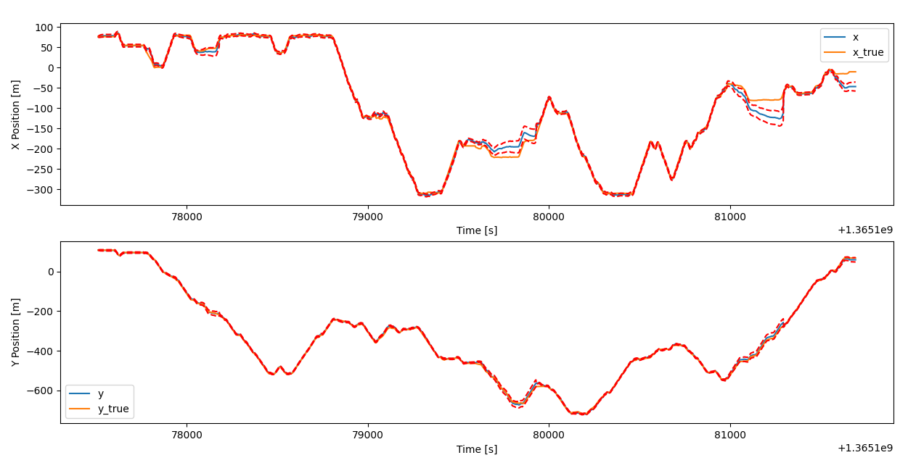

# MTE 546 Final Project
Extended Kalman Filter algorithm to globally localize a robot from the University of Michigan's [`North Campus Long-Term Vision and LIDAR Dataset`](https://robots.engin.umich.edu/nclt/). 

The EKF performs sensor fusion of IMU, Wheel Velocities, and Low-quality GPS data to estimate the 2D pose of the mobile robot. We acheive accuracy similar to that of GPS-RTK outdoors, as well as positional estimates indoors. 

See [our paper](./docs/Project-paper.pdf) for more.!

EKF estimate for "Wheels with GPS" mode for `2013-04-05` path. Blue: Estimated Position. Red: Ground Truth Position


EKF estimate for "Wheels with GPS" mode for `2015-05-11`  path. Blue: Estimated Position. Red: Ground Truth Position


Above plot, zoomed in:


EKF Estimation vs Ground Truth over time. Periods of divergence are when the robot looses GPS and travels indoors:


## Setup
- Download the dataset:
    - Download the specific date desired ( `sen.tar.gz` and `groundtruth.csv` files) from [the NCLT Dataset](https://robots.engin.umich.edu/nclt/) and unzip into `./src/dataset/<YYYY-MM-DD>`
    - Alternatively, unzip the `dataset.zip` into `./src/dataset`
- `pip install matplotlib numpy pandas sympy scipy lxml`

## Running:

From `src` folder, 
- `python read_ground_truth.py`
- `python read_gps.py`
- `python read_wheels.py`
- `python read_imu.py`
- `python IMU_processing.py`
- `python EKF.py 2013-04-05`: Run EKF with config given in `EKF.py` for the given path
- `python run_all.py`: Run EKF with config given in `EKF.py` for all paths in the dataset

## EKF Configuration

The EKF is able to run in different modes, using these parameters:

| `USE_WHEEL_AS_INPUT` | `USE_GPS_FOR_CORRECTION` | `USE_WHEEL_FOR_CORRECTION` | `USE_GPS_AS_INPUT` | Configuration Meaning |
|---|---|---|---|---|
| x | x | x | 1 | Use only GPS to estimate state |
| 0 | 0 | 0 | 0 | Use IMU as input, no corrections |
| 0 | 0 | 1 | 0 | Use IMU as input, correct with Wheels |
| 0 | 1 | 1 | 0 | Use IMU as input, correct with GPS and Wheels |
| 1 | 0 | x | 0 | Use Wheel as input, no corrections. Implicitly uses IMU's theta |
| 1 | 1 | x | 0 | Use Wheel as input, correct with GPS |


## Paths
The following paths do not have readable wheel velocities:
- `2012-01-08`
- `2012-01-22`
- `2012-02-12`
- `2012-03-17`
- `2012-05-26`
- `2012-06-15`

## References
```bibtex
@ARTICLE { ncarlevaris-2015a,
    AUTHOR = { Nicholas Carlevaris-Bianco and Arash K. Ushani and Ryan M. Eustice },
    TITLE = { University of {Michigan} {North} {Campus} long-term vision and lidar dataset },
    JOURNAL = { International Journal of Robotics Research },
    YEAR = { 2015 },
    VOLUME = { 35 },
    NUMBER = { 9 },
    PAGES = { 1023--1035 },
}
```
